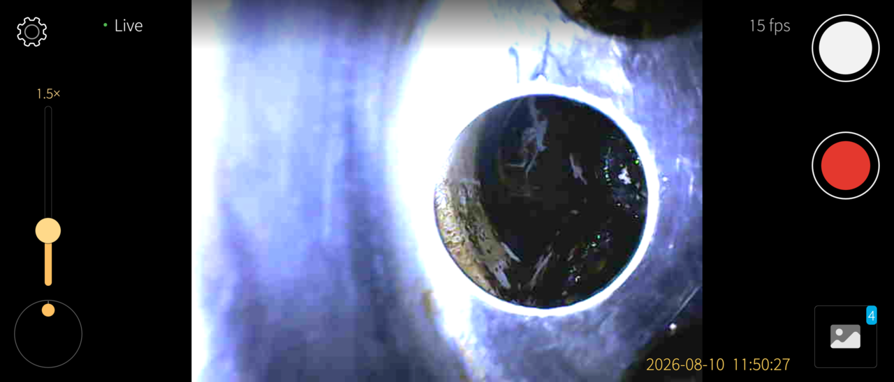
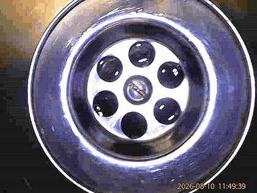
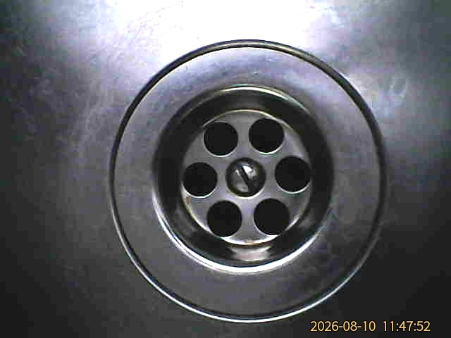
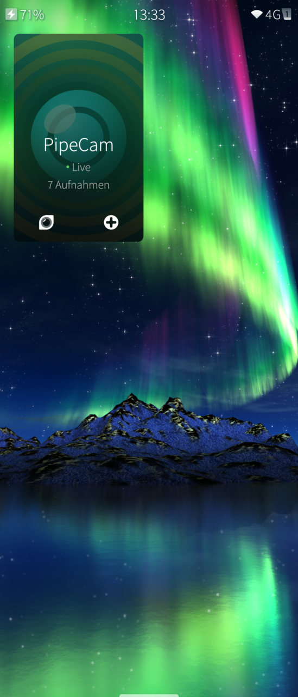

# harbour-pipecam

**Live view, snapshots and video recording for USB-C pipe inspection cameras on
Sailfish OS.**



These cheap endoscope cameras — sold as *USeePlus*, *Geek szitman* or
*supercamera* — look like webcams but are not. They announce themselves as
vendor-class USB devices, so no kernel driver binds them and **no `/dev/video`
node ever appears**. Linux tools that expect a V4L2 camera simply cannot see
them. PipeCam speaks their undocumented protocol directly over `libusb`.

Everything runs on the device. There is no network code in this application at
all: no telemetry, no cloud component, nothing to opt out of.

## Supported hardware

| USB ID | Sold as |
|--------|---------|
| `2ce3:3828` | Geek szitman / supercamera / USeePlus |
| `0329:2022` | same hardware, alternate ID |

640 × 480, MJPEG, roughly 11–15 fps. A typical unit has a ~10 m cable with an
inline push-button and a brightness dimmer wheel.

## What it does

- **Live view**, landscape-locked, with digital zoom to 8× and one-finger drag
  to pan the magnified image.
- **Roll dial** — a camera head sliding down a pipe twists as it goes; drag the
  dial to turn the picture back upright, tap its centre to level it.
- **Brightness** — a software gain, because the LED ring cannot be driven from
  the phone (see below) and pipes are dark.
- **Snapshots** written as the camera's own untouched JPEG — no decode, no
  re-encode, no generational loss.
- **Video** muxed straight into `.mp4` as an MJPEG track. Also no re-encoding:
  the camera already produces JPEGs and the muxer takes them as they are.
- **The button on the cable** takes a snapshot, toggles recording, or does
  nothing — your choice. Ten metres in, it is the only control you can reach.
- **Gallery** with rename and delete. Captures land in `~/Pictures/pipecam`.
- Optional burnt-in date and time, and a thirds grid.

Snapshots and recordings are byte-exact copies of what the camera sent — unless
the timestamp or the brightness gain is switched on. Those change pixels, so
each frame is drawn on and re-encoded before it is written. That is the right
trade for inspection footage: a recording with no date on it is much harder to
use as documentation months later than one that has been through a single extra
JPEG generation.

## See it working

Straight off the phone, recorded with the app itself.

| Going down a sink trap | Turning the picture upright |
|---|---|
|  |  |
| past the strainer, into the deposits | the roll dial, mid-recording, at ¾ speed |

The right-hand one shows the part that is easy to miss. The picture turns, the
frame is scaled down so nothing is cut off — hence the black corners — and the
burnt-in timestamp stays level and readable throughout, because the frame is
rotated first and stamped second.

> These two animations have been **heavily reduced to keep the repository
> small**: 420 pixels wide instead of 640, 8 frames per second instead of about
> 15, five seconds instead of ten, and 128 colours. They are noticeably softer
> and coarser than what the app actually shows. The real output is a 640×480
> MJPEG recording in which the timestamp is crisp and the detail is as good as
> the sensor allows — judge the picture quality from the still images above, not
> from these.

<p align="center">
  
  
</p>

A snapshot with the date burnt in, and the cover tile — which reports whether
frames are still arriving and how long a recording has been running, and offers
shutter and record without opening the app.

## Protocol

The camera is undocumented. This is what the protocol looks like, verified
against real hardware; `src/camera/uppprotocol.h` carries the full description.

Two commands are known:

```
FF 55 FF 55 EE 10     initialise      -> control interface, bulk OUT 0x02
BB AA 05 00 00        connect         -> stream interface, bulk OUT 0x01
```

The stream then arrives on bulk IN `0x81` as 1024-byte packets:

```
[5-byte USB header][7-byte camera header][JPEG slice]
  magic 0xBBAA, camera id, length      frame id, cam_num, flags, 32-bit field
```

**Frames are delimited by the frame-id byte changing — never by scanning for
JPEG `FFD8`/`FFD9` markers.** The device coalesces many packets into one bulk
transfer and every packet carries its own 12-byte header; stripping only the
leading one leaves the rest embedded in the JPEG entropy data. That produces a
corrupt image and a premature end-of-image, which is the well-known "half-grey
picture" failure.

Three things measured here differ from earlier published descriptions of this
device:

- **Camera id is always 7.** It is documented elsewhere as 7 *and* 11, described
  as two halves of one frame. Id 7 alone yields complete images and id 11 never
  appears at all, so the two ids are more likely two cameras — the second of
  which this unit does not emit.
- **`cam_num` is a frame toggle**, alternating 0/1 with every frame. Splitting
  the stream by it produces two sequences that show the same scene a fraction of
  a second apart, not two viewpoints.
- **The 32-bit field is not a g-sensor.** On a motionless cable it cycles
  strictly through four fixed values.

## Lighting

The LED ring **cannot be controlled from the phone**, and that is a measured
result rather than a missing feature: 60 seconds of capture while the dimmer
wheel was turned through its full range produced no change in any header field
and not one byte on the control endpoint — while a button press during the same
run appeared immediately. The wheel is an analogue potentiometer in the LED
supply that the firmware never sees.

The brightness control in the app therefore brightens the picture, not the lamp.

## USB permissions

The camera's raw USB node is `root:usb 0660` and the application user is not in
the `usb` group, so the package ships a udev rule scoped to these two USB IDs.

Its filename begins with `999-` on purpose. Sailfish on Android-based hardware
ships `999-android-system.rules` containing a catch-all that resets **every** USB
node to `0660 root:usb`, and udev applies files in filename order with the last
assignment winning — a `99-` prefixed rule is silently overwritten.

The `.desktop` file also has no `[X-Sailjail]` section, deliberately: no stock
sandbox permission grants raw USB access, and the sandbox gives an application a
private `/dev`, so a sandboxed build cannot reach the camera at all.

## Building

Requires the [Sailfish OS SDK](https://sailfishos.org/develop/).

```sh
mb2 -t SailfishOS-<version>-aarch64 build     # produces an RPM under RPMS/
```

Install on the device:

```sh
scp RPMS/harbour-pipecam-*.aarch64.rpm <device>:/tmp/
ssh <device> 'pkcon install-local -y /tmp/harbour-pipecam-*.aarch64.rpm'
```

Replug the camera afterwards, or run `udevadm trigger --subsystem-match=usb`, so
the new rule applies to a device that was already connected.

## Acknowledgements

The protocol was reconstructed with reference to prior reverse-engineering work
on this camera family, in particular the `ProbeView` project and the community
Linux drivers for the same devices.

## Status

Working, and used on real hardware, but young. Shared **as is** with **no
warranty** of any kind — see the [GPLv3](LICENSE).

## Licence

**GNU General Public License v3.0 or later.**
