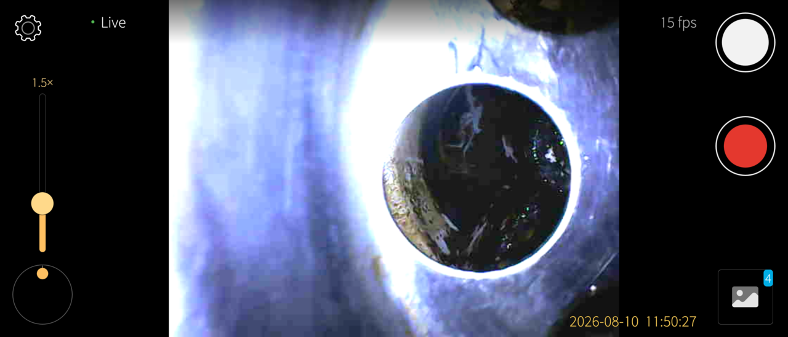
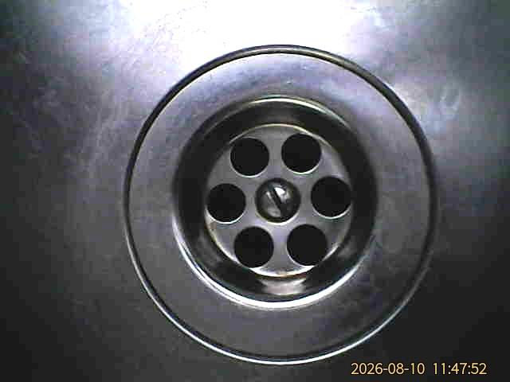
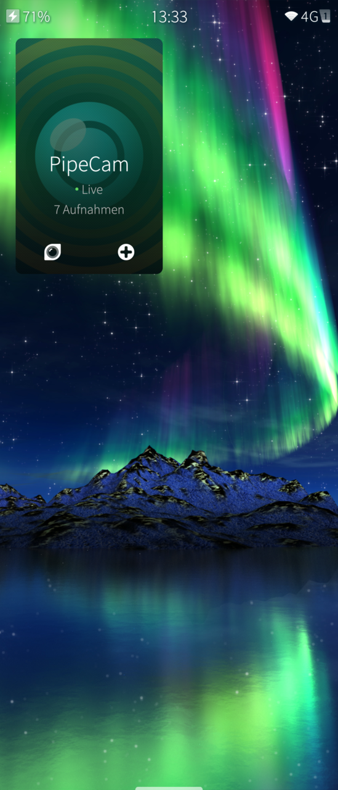

# harbour-pipecam

Viewer and recorder for USB-C pipe inspection cameras on Sailfish OS.



- Vendor-class USB device, no kernel driver, no `/dev/video`. Spoken to directly via `libusb`.
- No network code.

## Supported hardware

| USB ID | Sold as |
|--------|---------|
| `2ce3:3828` | Geek szitman / supercamera / USeePlus |
| `0329:2022` | same hardware, alternate ID |

| Variant | Descriptor | Stream | Cable button | Status |
|---------|------------|--------|--------------|--------|
| MJPEG | 2 interfaces (`bcdDevice 1.00`) | 640 × 480 MJPEG, 11–15 fps | yes | verified |
| YUYV | 1 interface, bulk `0x82`/`0x02` (`bcdDevice 1.11`) | 320 × 240 YUYV | no | untested on hardware |

## Features

- Live view, landscape, digital zoom to 8×, drag to pan
- Roll dial: drag to rotate, tap centre to level
- Software brightness gain to 3×
- Snapshot: camera JPEG unchanged
- Video: MJPEG track muxed into `.mp4`, no re-encode
- Cable button: snapshot / record / off
- Gallery: rename, delete; files in `~/Pictures/pipecam`
- Optional burnt-in timestamp, thirds grid
- Timestamp, gain or capture rotation on → frames re-encoded

| Sink trap | Roll dial during recording |
|---|---|
|  |  |

GIFs reduced: 420 px, 8 fps, 128 colours. Actual output: 640 × 480 MJPEG.

<p align="center">
  
  
</p>

## Protocol (MJPEG variant)

Full description: `src/camera/uppprotocol.h`.

```
FF 55 FF 55 EE 10     init     -> bulk OUT 0x02
BB AA 05 00 00        connect  -> bulk OUT 0x01
```

Stream on bulk IN `0x81`, 1024-byte packets:

```
[5-byte USB header][7-byte camera header][JPEG slice]
  magic 0xBBAA, camera id, length      frame id, cam_num, flags, 32-bit field
```

- Frame boundary = frame-id change. Not `FFD8`/`FFD9`: every packet in a bulk transfer has its own 12-byte header.
- Camera id: always 7. Id 11 never seen.
- `cam_num`: toggles 0/1 per frame.
- 32-bit field: cycles through four fixed values on a static cable; not a g-sensor.
- LED ring: analogue dimmer, not visible to the firmware. Not controllable.

## USB permissions

- udev rule for both IDs, `0666`. Prefix `999-`: `999-android-system.rules` resets all USB nodes to `0660 root:usb`; last match wins.
- `.desktop`: `Sandboxing=Disabled`. No Sailjail permission grants raw USB; without the key the default profile still applies (PID namespace, no-new-privileges, seccomp).

## Diagnostic report

Settings → About → **Create diagnostic report**, or `harbour-pipecam --report [--root]`.

- Contents: versions, OS, phone model, USB descriptor tree, detected variant, interface drivers, node permissions, Type-C role, claim test, app log.
- Removed on the device: serial numbers, host name, user name, home directory, MAC/IP/e-mail addresses, IMEI-length numbers.
- **Verbose log**: adds libusb messages; written to `~/.cache/harbour-pipecam/pipecam.log`, kept across a crash.
- **Include root data**: read-only `harbour-pipecam-helper.service` (polkit-scoped, not started at boot, exits when unused): holders of the camera node, kernel USB table, kernel and journal lines about USB.

Issues: <https://github.com/JimKnopfIoT/harbour-pipecam/issues>

## Building

[Sailfish OS SDK](https://sailfishos.org/develop/):

```sh
mb2 -t SailfishOS-<version>-aarch64 build
scp RPMS/harbour-pipecam-*.aarch64.rpm <device>:/tmp/
ssh <device> 'pkcon install-local -y /tmp/harbour-pipecam-*.aarch64.rpm'
```

Then replug the camera or run `udevadm trigger --subsystem-match=usb`.

## Acknowledgements

- MJPEG protocol: `ProbeView` and community Linux drivers for this camera family
- YUYV variant: [Endoscope_Viewer](https://github.com/Bognabon/Endoscope_Viewer), [supercamera-yuyv-linux](https://github.com/KlumpRasmus/supercamera-yuyv-linux)

## Licence

GPL-3.0-or-later, no warranty. See [LICENSE](LICENSE).
